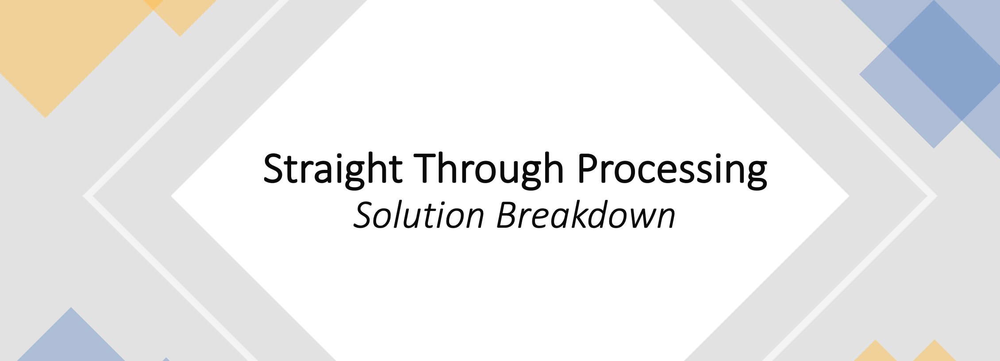
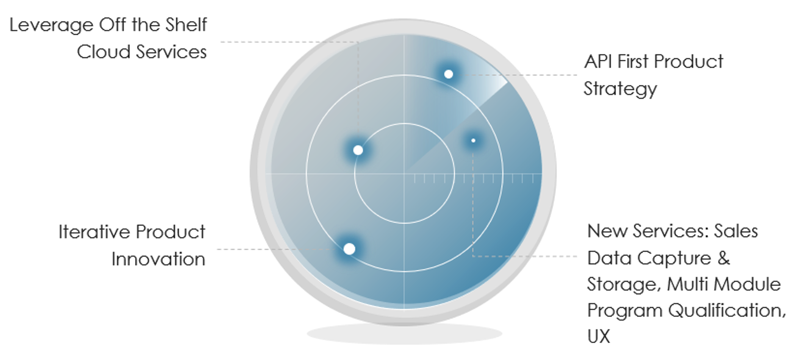
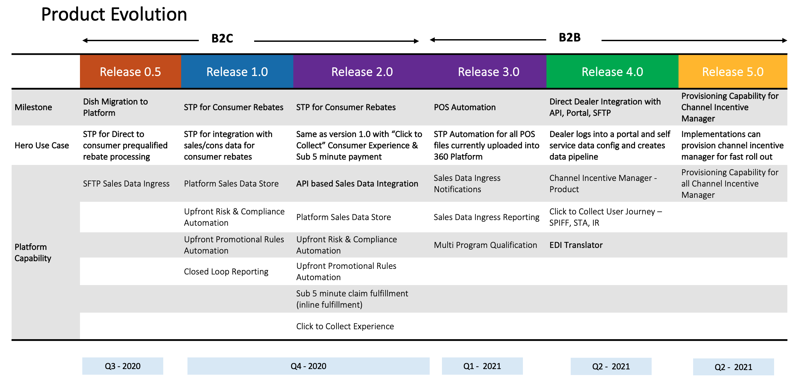
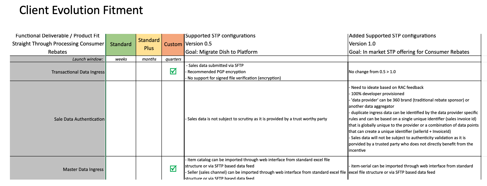
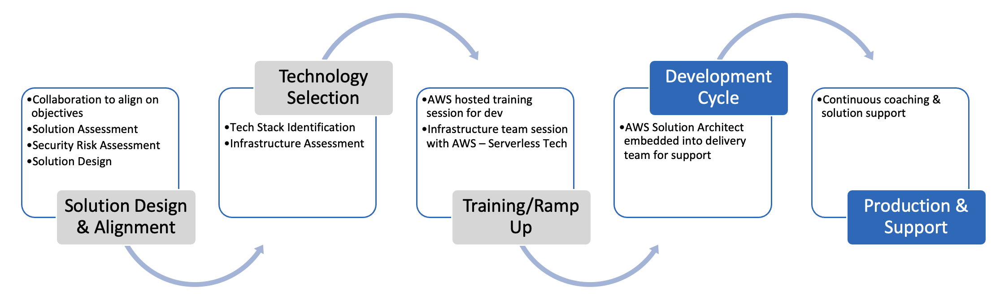
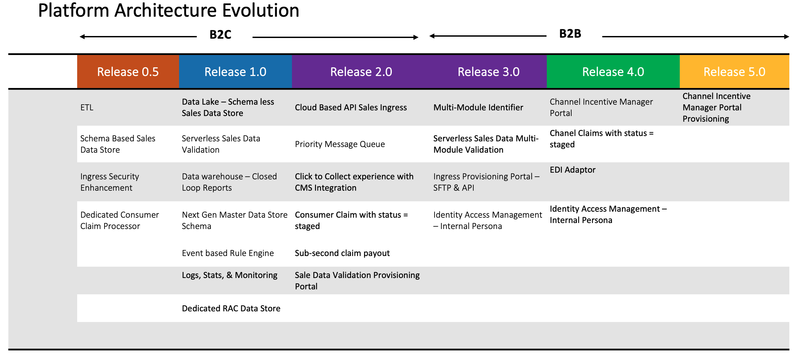
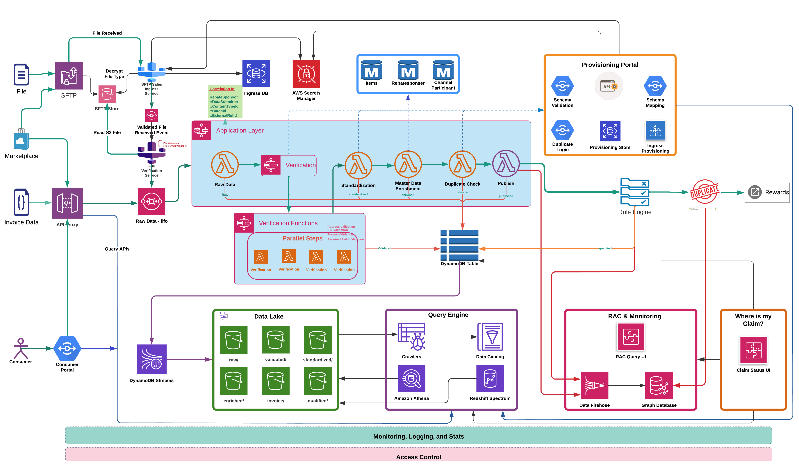

## *Content*

• Vision, Mission, Goal

• Problem Statement

• Product Evolution

• Client Evolution Fitment

• Aligned Solution Architecture

• Stages of Solution Delivery

## **Vision**

* Frictionless Claim Experience
* Automated Claim Entry
* Lights-out business

## **Mission**

* Direct Integration, KYC and Single Invoice

## **Goal**

* Streamline the Claim Process: STP

## *Quotes*

**Opportunity** is missed by **most** **people** because it dresses in **overalls** and looks **like work.**

**…Thomas Edison**

## *Product Strategy*

## *Product Evolution*

## *Client Evolution Fitment*

## *AWS Partnership*

## *Platform Architecture Evolution*

## *Aligned Solution Architecture*

